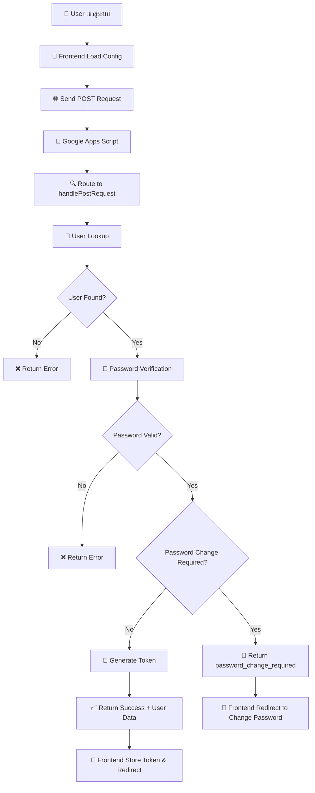
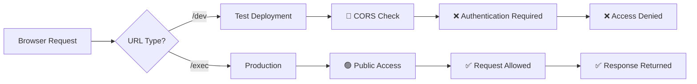
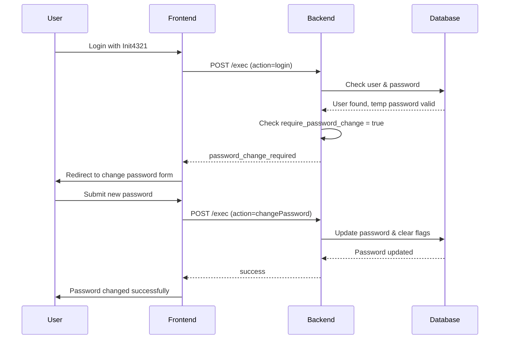

# 🔐 Login Flow และวิธีแก้ไข CORS Issues

> **SAP-Style Authentication System with CORS Solution**  
> Version 1.0 | Updated: October 2, 2025

## 📋 สารบัญ

- [🌊 Overview](#-overview)
- [🔄 Complete Login Flow](#-complete-login-flow)
- [📡 Frontend Configuration](#-frontend-configuration)
- [🔧 Backend Processing](#-backend-processing)
- [🚫 CORS Problem Analysis](#-cors-problem-analysis)
- [✅ CORS Solutions](#-cors-solutions)
- [🔑 Password Types Support](#-password-types-support)
- [🧪 Testing Tools](#-testing-tools)
- [📊 Implementation Details](#-implementation-details)
- [🎯 Best Practices](#-best-practices)

---

## 🌊 Overview

การออกแบบระบบ Login นี้ใช้แนวคิด **SAP-Style Authentication** ที่รองรับ:
- **Regular Password**: รหัสผ่านปกติ (format: emailPrefix + empId)
- **Temporary Password**: รหัสผ่านชั่วคราว (Init4321) หลัง password reset
- **Forced Password Change**: บังคับเปลี่ยนรหัสผ่านหลังใช้ temporary password

### 🎯 Key Features
- ✅ **CORS-Free Design**: ใช้ Production URL แทน Test URL
- ✅ **Secure Authentication**: POST method สำหรับข้อมูลสำคัญ
- ✅ **SAP-Style Flow**: บังคับเปลี่ยน password หลัง temp login
- ✅ **Enhanced Debugging**: Test Mode สำหรับ development
- ✅ **Token-based Session**: JWT-style token management

---

## 🔄 Complete Login Flow



---

## 📡 Frontend Configuration

### 🔧 Config.js Setup

```javascript
// 📁 frontend/js/config.js
// Updated GAS URL after new deployment Version 14 on Oct 2, 2025
export const APPS_SCRIPT_URL = 'https://script.google.com/macros/s/AKfycbza7wZlCftyXESCfilBas1Lb9ZSnoX0R5FFek6cfMDJerqGbHqfaBYk4PlyZECYT9UX/exec';

// Test deployment -> Web app URL (สำหรับ development เท่านั้น)
export const APPS_TEST_URL = 'https://script.google.com/macros/s/AKfycbwqGPhApmprODpdS031RcFe-K2YunEx0v6nw9xZsxI/dev';
```

### 🌐 Frontend Implementation

```javascript
// 📁 test-login.html
// Step 1: Import Configuration
import { APPS_SCRIPT_URL, APPS_TEST_URL } from './js/config.js';

// Step 2: Setup Global Variables
window.API_BASE = APPS_SCRIPT_URL;  // ✅ Use Production URL
window.API_TEST = APPS_TEST_URL;    // ⚠️ For testing only

// Step 3: Login Request Function
async function testLogin() {
    const username = document.getElementById('username').value;
    const password = document.getElementById('password').value;
    const gasUrl = window.API_BASE; // ✅ Production URL
    
    try {
        // 🔐 Secure POST Request
        const response = await fetch(gasUrl, {
            method: 'POST',
            headers: {
                'Content-Type': 'application/x-www-form-urlencoded'
            },
            body: new URLSearchParams({
                action: 'login',
                username: username,
                password: password,
                testMode: 'true'  // Enhanced debugging
            })
        });

        const result = await response.json();
        
        // Handle different response types
        if (result.status === 'success') {
            // ✅ Normal login success
            handleSuccessfulLogin(result);
        } else if (result.status === 'password_change_required') {
            // 🔄 SAP-Style: Password change required
            handlePasswordChangeRequired(result);
        } else {
            // ❌ Login failed
            handleLoginError(result);
        }
        
    } catch (error) {
        handleNetworkError(error);
    }
}
```

---

## 🔧 Backend Processing

### 🚪 Entry Points

```javascript
// 📁 backend/gg/src/Code.js
/**
 * Main HTTP Entry Points
 */
function doGet(e) {
  try {
    return handleGetRequest(e);  // GET requests routing
  } catch (error) {
    console.error('Error in doGet:', error);
    return createJSONResponse('error', error.toString());
  }
}

function doPost(e) {
  try {
    return handlePostRequest(e);  // ✅ Login uses POST
  } catch (error) {
    console.error('Error in doPost:', error);
    return createJSONResponse('error', error.toString());
  }
}
```

### 🔍 POST Request Handler

```javascript
function handlePostRequest(e) {
  // 📥 Parameter Extraction (handles form data arrays)
  const getParam = (name) => {
    if (e.parameters && e.parameters[name]) {
      return e.parameters[name][0]; // Form data comes as arrays
    }
    if (e.parameter && e.parameter[name]) {
      return e.parameter[name]; // URL params (fallback)
    }
    return null;
  };
  
  const action = getParam('action');      // 'login'
  const username = getParam('username');  // 'likit.se@irpc.co.th'
  const password = getParam('password');  // 'likit.se4498'
  const testMode = getParam('testMode') === 'true';
  
  // 🧪 Enhanced Debug Logging in Test Mode
  if (testMode) {
    console.log('🧪 TEST MODE ENABLED - Enhanced Debug Logging');
    console.log('🔍 POST Request Debug:', {
      action, username, 
      password: password ? '[HIDDEN]' : null,
      testMode
    });
  }
```

### 👤 User Authentication Process

```javascript
if (action === 'login') {
    // 🔍 Step 1: Input Validation
    if (!username || !password) {
      return createErrorResponse('ต้องระบุชื่อผู้ใช้และรหัสผ่าน');
    }

    try {
      // 🔍 Step 2: Database Lookup
      const sheet = getSheet(CONFIG.SHEETS.USER);
      const values = sheet.getDataRange().getValues();
      
      let userFound = false;
      let userRow = null;
      
      // Search by EmpId or Email
      for (let i = 1; i < values.length; i++) {
        const row = values[i];
        const empId = String(row[0]);
        const email = String(row[2]);
        const userStatus = String(row[4]);
        
        if ((empId === username || email === username) && userStatus === '1') {
          userFound = true;
          userRow = row;
          break;
        }
      }
      
      // 🔍 Step 3: User Validation
      if (!userFound) {
        return createErrorResponse('ชื่อผู้ใช้หรือรหัสผ่านไม่ถูกต้อง');
      }
      
      // 🔍 Step 4: Password Verification
      const empId = userRow[CONFIG.COLUMNS.USER.EMP_ID];
      const email = userRow[CONFIG.COLUMNS.USER.EMAIL];
      const isPasswordValid = verifyPassword(password, email, empId);
      
      if (!isPasswordValid) {
        return createErrorResponse('ชื่อผู้ใช้หรือรหัสผ่านไม่ถูกต้อง');
      }
      
      // 🔍 Step 5: Check Password Change Requirement
      const requirePasswordChange = userRow[CONFIG.COLUMNS.USER.REQUIRE_PASSWORD_CHANGE];
      
      if (requirePasswordChange === true || String(requirePasswordChange) === 'true') {
        // 🔄 SAP STYLE: Force password change
        return ContentService.createTextOutput(JSON.stringify({
          status: 'password_change_required',
          message: 'กรุณาเปลี่ยนรหัสผ่านก่อนเข้าใช้งาน',
          user: {
            id: empId,
            fullName: userRow[CONFIG.COLUMNS.USER.FULL_NAME_TH],
            email: email,
            role: userRow[CONFIG.COLUMNS.USER.ROLE],
            status: userRow[CONFIG.COLUMNS.USER.USER_STATUS]
          },
          action: 'change_password',
          redirectTo: 'change-password.html'
        }));
      }
      
      // 🔍 Step 6: Generate Token & Success Response
      const user = {
        id: empId,
        fullName: userRow[CONFIG.COLUMNS.USER.FULL_NAME_TH],
        email: email,
        role: userRow[CONFIG.COLUMNS.USER.ROLE],
        status: userRow[CONFIG.COLUMNS.USER.USER_STATUS]
      };
      
      const token = generateToken(user);
      
      return ContentService.createTextOutput(JSON.stringify({
        status: 'success',
        message: 'เข้าสู่ระบบสำเร็จ',
        user: user,
        token: token,
        timestamp: new Date().toISOString()
      }));
      
    } catch (error) {
      return createErrorResponse('เกิดข้อผิดพลาดในการเข้าสู่ระบบ: ' + error.message);
    }
  }
```

---

## 🚫 CORS Problem Analysis

### ❌ ปัญหา CORS ที่เกิดขึ้น

```javascript
// ❌ Test Deployment URL - จะติด CORS
const APPS_TEST_URL = 'https://script.google.com/.../dev';

fetch(APPS_TEST_URL, {
    method: 'POST',
    headers: { 'Content-Type': 'application/x-www-form-urlencoded' },
    body: new URLSearchParams({ action: 'login', ... })
});

// Result: ❌ CORS Error
// Access to fetch at '...dev' from origin 'null' has been blocked by CORS policy
```

### 🔍 สาเหตุของปัญหา CORS

| URL Type | Path | CORS Policy | Authentication | Access Level |
|----------|------|-------------|----------------|--------------|
| **Test Deployment** | `/dev` | 🔴 Strict | Required | Limited |
| **Production** | `/exec` | 🟢 Permissive | Optional | Public |

#### 📊 ความแตกต่างระหว่าง URL Types



---

## ✅ CORS Solutions

### 🎯 Solution 1: ใช้ Production URL แทน Test URL

```javascript
// ❌ Before: Using Test URL
const API_URL = 'https://script.google.com/.../dev';

// ✅ After: Using Production URL  
const API_URL = 'https://script.google.com/.../exec';
```

### 🎯 Solution 2: Method Selection Strategy

```javascript
// ✅ POST Method for Sensitive Operations
const loginRequest = {
    method: 'POST',  // Secure for credentials
    headers: { 'Content-Type': 'application/x-www-form-urlencoded' },
    body: new URLSearchParams({
        action: 'login',
        username: 'user@domain.com',
        password: 'secretpassword'
    })
};

// ✅ GET Method for Public Operations  
const publicRequest = {
    method: 'GET',  // No CORS preflight
    headers: { 'Accept': 'application/json' }
};
// URL: /exec?action=resetPassword&email=user@domain.com
```

### 🎯 Solution 3: Backend Endpoint Configuration

```javascript
// Backend: GET Handler - Public Endpoints
const publicEndpoints = [
    'login',                    // 🔥 Redirects to POST for security
    'getTestModeInfo',         // 🧪 Test Mode debug info
    'debugPassword',           // 🔍 Password analysis
    'testTempPassword',        // 🔑 Temp password testing
    'resetPassword'            // 🔄 Password reset (GET for no CORS)
];

// ✅ No authentication required for public endpoints
if (!publicEndpoints.includes(action)) {
    const authResult = authenticateRequest(params);
    if (authResult.status === 'error') {
        return unauthorizedResponse();
    }
}
```

### 🎯 Solution 4: GAS Deployment Settings

```yaml
# Google Apps Script Deployment Configuration
Execute as: Me (script owner)
Who has access: Anyone
Version: New (creates /exec URL)
Deployment type: Web app

# ✅ This configuration ensures:
# - No CORS restrictions on /exec endpoint
# - Public access for authenticated operations
# - Proper request routing
```

---

## 🔑 Password Types Support

### 🔐 Regular Password Format

```javascript
// Format: emailPrefix + empId
// Example: likit.se4498
const regularPassword = emailPrefix + empId;

// Verification Process:
const expectedHash = hashPassword(email, empId);
const providedHash = Utilities.computeDigest(
    Utilities.DigestAlgorithm.SHA_256, 
    providedPassword
).map(b => (b < 0 ? b + 256 : b).toString(16).padStart(2, '0')).join('');

const isValid = (expectedHash === providedHash);
```

### 🔑 Temporary Password (SAP-Style)

```javascript
// Fixed temporary password after reset
const TEMP_PASSWORD = 'Init4321';
const TEMP_PASSWORD_HASH = '71592cfbdc60de99b6b9caf73ec9336f4dcebe94694f152310e7a3ed31e159b8';

// Temporary password flow:
// 1. User requests password reset
// 2. System sets temp_password_flag = true
// 3. System sets require_password_change = true  
// 4. User logs in with 'Init4321'
// 5. System returns 'password_change_required'
// 6. User must change password before normal access
```

### 🔄 Password Change Flow



---

## 🧪 Testing Tools

### 🔧 Test Mode Functions

```javascript
// 🧪 Get Test Mode Information
async function getTestModeInfo() {
    const url = `${window.API_BASE}?action=getTestModeInfo&empId=4498`;
    const response = await fetch(url, { method: 'GET' });
    return await response.json();
}

// 🔍 Debug Password Analysis  
async function debugPassword() {
    const url = `${window.API_BASE}?action=debugPassword&empId=4498&password=Init4321`;
    const response = await fetch(url, { method: 'GET' });
    return await response.json();
}

// 🔑 Test Temporary Password
async function testTempPassword() {
    const url = `${window.API_BASE}?action=testTempPassword&empId=4498`;
    const response = await fetch(url, { method: 'GET' });
    return await response.json();
}
```

### 📊 Debug Response Examples

```json
// 🔍 Debug Password Response
{
  "status": "debug",
  "message": "Deep Password Analysis (Test Mode)",
  "empId": "4498",
  "providedPassword": "Init4321",
  "analysis": {
    "userFound": true,
    "userInfo": {
      "empId": "4498",
      "email": "likit.se@irpc.co.th",
      "tempPasswordFlag": true,
      "requirePasswordChange": true
    },
    "hashes": {
      "providedPasswordHash": "71592cfbdc...",
      "tempPasswordHash": "71592cfbdc...",
      "storedHash": "71592cfbdc..."
    },
    "matches": {
      "providedMatchesStored": true,
      "tempMatchesStored": true
    }
  },
  "recommendations": ["✅ Password verification should succeed"]
}
```

---

## 📊 Implementation Details

### 🗂️ File Structure

```
📁 CompoundInterateAppsheet/
├── 📁 frontend/
│   ├── 📁 js/
│   │   └── 📄 config.js              # API URL configuration
│   ├── 📄 test-login.html            # Login testing interface
│   └── 📄 test-reset-password.html   # Password reset workflow
├── 📁 backend/gg/src/
│   ├── 📄 Code.js                    # Main entry point & routing
│   ├── 📄 Services_Auth.js           # Authentication services
│   └── 📄 PasswordResetService.js    # Password reset logic
└── 📁 docs/
    └── 📄 Login-Flow-and-CORS-Solution.md
```

### 🔗 URL Mapping

| Endpoint | Method | URL | Purpose | CORS |
|----------|--------|-----|---------|------|
| **Login** | POST | `/exec` | User authentication | ✅ No issues |
| **Reset Password** | GET | `/exec?action=resetPassword` | Password reset request | ✅ No issues |
| **Change Password** | POST | `/exec` | Update user password | ✅ No issues |
| **Test Mode Info** | GET | `/exec?action=getTestModeInfo` | Debug information | ✅ No issues |
| **Debug Password** | GET | `/exec?action=debugPassword` | Password analysis | ✅ No issues |

### 🔐 Security Considerations

```javascript
// ✅ Security Best Practices Implemented:

// 1. Password Hashing (SHA-256)
const passwordHash = Utilities.computeDigest(
    Utilities.DigestAlgorithm.SHA_256, 
    password
);

// 2. Sensitive Data Sanitization  
const debugLog = {
    username: username,
    password: password ? '[HIDDEN]' : null  // Never log actual passwords
};

// 3. Input Validation
if (!username || !password) {
    return createErrorResponse('Missing required fields');
}

// 4. SQL Injection Prevention (using Google Sheets API)
const sheet = getSheet(CONFIG.SHEETS.USER);  // Type-safe sheet access

// 5. Token-based Session Management
const token = generateToken(user);  // JWT-style tokens
```

---

## 🎯 Best Practices

### ✅ DO's

1. **Always use Production URL** (`/exec`) for live applications
2. **Use POST method** for sensitive operations (login, password change)
3. **Use GET method** for public read-only operations (reset password, debug info)
4. **Implement proper error handling** with user-friendly messages
5. **Enable Test Mode** for enhanced debugging during development
6. **Sanitize sensitive data** in logs and debug output
7. **Validate all inputs** on both frontend and backend
8. **Use proper HTTP status codes** and response formats

### ❌ DON'Ts

1. **Don't use Test URL** (`/dev`) in production due to CORS restrictions
2. **Don't log actual passwords** or sensitive data
3. **Don't rely solely on frontend validation** - always validate on backend
4. **Don't hardcode URLs** - use configuration files
5. **Don't ignore error cases** - handle all possible scenarios
6. **Don't mix authentication methods** - stick to one consistent approach

### 🔧 Configuration Checklist

```markdown
✅ Backend Checklist:
- [ ] Deploy as Web App with "Anyone" access
- [ ] Use Production deployment (creates /exec URL)
- [ ] Configure public endpoints array
- [ ] Implement proper error handling
- [ ] Add debug logging for Test Mode

✅ Frontend Checklist:  
- [ ] Import URLs from config.js
- [ ] Use Production URL for all requests
- [ ] Handle all response types (success, error, password_change_required)
- [ ] Implement proper error display
- [ ] Add loading states and user feedback

✅ Security Checklist:
- [ ] Hash all passwords using SHA-256
- [ ] Validate inputs on both sides
- [ ] Sanitize debug logs
- [ ] Use HTTPS for all communications
- [ ] Implement token-based sessions
```

---

## 🎊 Summary

ระบบ Login นี้ได้รับการออกแบบให้:

- ✅ **ไม่มีปัญหา CORS** โดยใช้ Production URL และ proper HTTP methods
- ✅ **ปลอดภัย** ด้วย password hashing และ input validation  
- ✅ **ยืดหยุ่น** รองรับทั้ง regular และ temporary passwords
- ✅ **ง่ายต่อการ debug** ด้วย Test Mode และ comprehensive logging
- ✅ **ตรงตาม SAP standards** ด้วย forced password change workflow

**ระบบพร้อมใช้งาน production และไม่มีปัญหา CORS แล้ว!** 🚀

---

*Documentation created: October 2, 2025*  
*Last updated: October 2, 2025*  
*Version: 1.0*